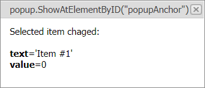

<!-- default badges list -->

<!-- default badges end -->
# Popup Control for ASP.NET Web Forms - How to show a pop-up window
This example demonstrates various ways to display a default pop-up window.

## Overview

The [ASPxPopupControl](https://docs.devexpress.com/AspNet/DevExpress.Web.ASPxPopupControl) creates a default pop-up window when the control's [Windows](https://docs.devexpress.com/AspNet/DevExpress.Web.ASPxPopupControl.Windows) collection is empty. You can change the default pop-up window's visibility on the server or client.

Set the [ShowOnPageLoad](https://docs.devexpress.com/AspNet/DevExpress.Web.ASPxPopupControlBase.ShowOnPageLoad) property to **true** on the server to display the default pop-up window when a client browser loads the page.

Call one of the following client-side methods to show the default pop-up window:

* **[Show](https://docs.devexpress.com/AspNet/js-ASPxClientPopupControlBase.Show)**  
Displays the pop-up window at a pop-up element with the specified index. Use the [PopupHorizontalAlign](https://docs.devexpress.com/AspNet/DevExpress.Web.ASPxPopupControl.PopupHorizontalAlign), [PopupHorizontalOffset](https://docs.devexpress.com/AspNet/DevExpress.Web.ASPxPopupControl.PopupHorizontalOffset), [PopupVerticalAlign](https://docs.devexpress.com/AspNet/DevExpress.Web.ASPxPopupControl.PopupVerticalAlign), and [PopupVerticalOffset](https://docs.devexpress.com/AspNet/DevExpress.Web.ASPxPopupControl.PopupVerticalOffset) properties to specify the window's position relative to the element.

* **[ShowAtPos](https://docs.devexpress.com/AspNet/js-ASPxClientPopupControlBase.ShowAtPos(x-y))**  
Displays the pop-up window at the specified position.

* **[ShowAtElement](https://docs.devexpress.com/AspNet/js-ASPxClientPopupControlBase.ShowAtElement(htmlElement))**  
Displays the pop-up window over the specified HTML element.

* **[ShowAtElementByID](https://docs.devexpress.com/AspNet/js-ASPxClientPopupControlBase.ShowAtElementByID(id))**  
Displays the pop-up window over an HTML element with the specified identifier.

<!-- default file list -->

## Files to Look At

* [Default.aspx](./CS/WebSite/Default.aspx) (VB: [Default.aspx](./VB/WebSite/Default.aspx))
* [Default.aspx.cs](./CS/WebSite/Default.aspx.cs) (VB: [Default.aspx.vb](./VB/WebSite/Default.aspx.vb))

<!-- default file list end -->

## Documentation

- [How to: Show the Default Window](https://docs.devexpress.com/AspNet/115457/components/docking-and-popups/popup-control/popup-windows/default-window)
- [How to: Show and Hide Windows](https://docs.devexpress.com/AspNet/115458/components/docking-and-popups/popup-control/popup-windows/manipulating-windows)

## More Examples

- [Popup Control for ASP.NET Web Forms - How to show and hide a pop-up window on the server side](https://supportcenter.devexpress.com/internal/ticket/details/E499)
- [Popup Control for ASP.NET Web Forms - How to add buttons to a popup window](https://www.devexpress.com/Support/Center/p/E493)
